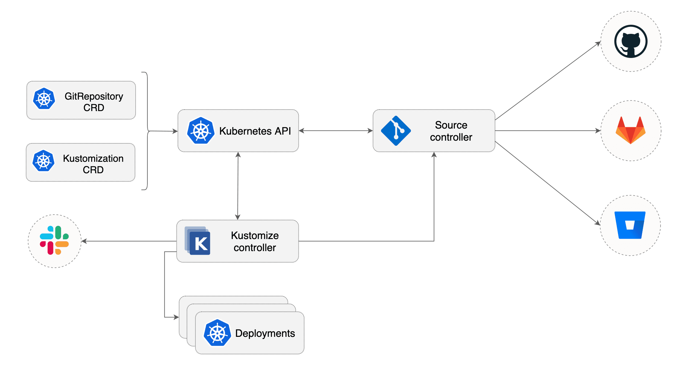

# kustomize-controller

The kustomize-controller is a Kubernetes operator that applies kustomizations in-cluster.



Features:
* watches for `Kustomization` objects
* fetches artifacts produced by `GitRepository` objects
* watches `GitRepository` objects for revision changes 
* builds the kustomization using the latest fetched artifact
* applies the resulting Kubernetes manifests on the cluster
* prunes the Kubernetes objects removed from git based on a label selector

## Kustomization API

A kustomization object defines the source of Kubernetes manifests by referencing a Git repository
(managed by [source-controller](https://github.com/fluxcd/source-controller)),
the path to the kustomization file, 
and a label selector used for garbage collection of resources removed from the Git source.

Specification:

```go
// KustomizationSpec defines the desired state of a kustomization.
type KustomizationSpec struct {
	// Path to the directory containing the kustomization file.
	// +kubebuilder:validation:Pattern="^\\./"
	// +required
	Path string `json:"path"`

	// Label selector used for prune operations, e.g. env=staging.
	// +kubebuilder:validation:Pattern="^.*=.*$"
	// +optional
	Prune string `json:"prune,omitempty"`

	// Reference of the Git repository where the kustomization source is.
	// +required
	GitRepositoryRef corev1.LocalObjectReference `json:"gitRepositoryRef"`

	// The interval at which to apply the kustomization.
	// +required
	Interval metav1.Duration `json:"interval"`
}
```

## Usage

Build prerequisites:
* go >= 1.13
* kubebuilder
* kustomize
* kubectl

### Install the controllers

Install source-controller with:

```bash
git clone https://github.com/fluxcd/source-controller
cd source-controller
make docker-build docker-push dev-deploy IMG=your-docker-hub-username/source-controller:test
```

Install kustomize-controller with:

```bash
git clone https://github.com/fluxcd/kustomize-controller
cd kustomize-controller
make docker-build docker-push dev-deploy IMG=your-docker-hub-username/kustomize-controller:test
```

### Define a Git repository source

```yaml
apiVersion: source.fluxcd.io/v1alpha1
kind: GitRepository
metadata:
  name: podinfo
  namespace: default
spec:
  interval: 1m
  url: https://github.com/stefanprodan/podinfo-deploy
  ref:
    branch: master
```

Save the above file and apply it on the cluster.
You can wait for the source controller to assemble an artifact from the head of the repo master branch with:

```bash
kubectl wait gitrepository/podinfo --for=condition=ready
```

The source controller will check for new commits in the master branch every minute. You can force a git sync with:

```bash
kubectl annotate --overwrite gitrepository/podinfo source.fluxcd.io/syncAt="$(date +%s)"
```

### Define a kustomization

Create a kustomization object that uses the git repository defined above:

```yaml
apiVersion: kustomize.fluxcd.io/v1alpha1
kind: Kustomization
metadata:
  name: podinfo-dev
spec:
  interval: 5m
  path: "./overlays/dev/"
  prune: "env=dev"
  gitRepositoryRef:
    name: podinfo
```

With `spec.path` we tell the controller where to look for the kustomization file and with `spec.prune` we 
configure garbage collection. With `spec.interval` we tell the controller how often it should reconcile 
the cluster state.

Save the above file and apply it on the cluster.
You can wait for the kustomize controller to apply the manifest corresponding to the dev overlay with:

```bash
kubectl wait kustomization/podinfo-dev --for=condition=ready
```

When the controller finishes the reconciliation, the following objects will be created on your cluster:

```text
namespace/dev created
service/podinfo created
deployment.apps/podinfo created
horizontalpodautoscaler.autoscaling/podinfo created
```

You can trigger a kustomize build and apply any time with:

```bash
kubectl annotate --overwrite kustomization/podinfo-dev kustomize.fluxcd.io/syncAt="$(date +%s)"
```

When the source controller pulls a new Git revision, the kustomize controller will detect that the
source revision changed, and will apply those changes right away.

If the kustomization build or apply fails, the controller sets the ready condition to `false` and logs the error:

```yaml
status:
  conditions:
  - lastTransitionTime: "2020-04-16T07:27:58Z"
    message: 'kubectl apply error: exit status 1'
    reason: ApplyFailed
    status: "False"
    type: Ready
``` 

```json
{"Kustomization": "default/podinfo-dev", "error": "kubectl apply: Error from server (NotFound): error when creating \"podinfo-dev.yaml\": namespaces \"dev\" not found\n"}
```

### Deploy releases to production

For production deployments, instead of synchronizing with a branch you can use a semver range to target stable releases:

```yaml
apiVersion: source.fluxcd.io/v1alpha1
kind: GitRepository
metadata:
  name: podinfo-releases
spec:
  interval: 5m
  url: https://github.com/stefanprodan/podinfo-deploy
  ref:
    semver: ">=0.0.1-rc.1 <1.0.0"
```

With `ref.semver` we configure source controller to pull the Git tags and create an artifact from the most recent tag
that matches the semver range.

Create a production kustomization and reference the git source that follows the latest semver release:

```yaml
apiVersion: kustomize.fluxcd.io/v1alpha1
kind: Kustomization
metadata:
  name: podinfo-production
spec:
  interval: 10m
  path: "./overlays/production/"
  prune: "env=production"
  gitRepositoryRef:
    name: podinfo-releases
```

Based on the above definition, the kustomize controller will build and apply a kustomization that matches the semver range
set in the Git repository manifest.

## GitOps pipeline

Example:
* create a `GitRepository` per app (example repo [podinfo-deploy](https://github.com/stefanprodan/podinfo-deploy))
* create a `Kustomization` per app/environment 
* push changes to a kustomize overlay in git
* source controller pulls the changes from git and creates an artifact
* kustomize controller fetches the latest artifact
* kustomize controller builds the overlay manifest and applies it on the cluster
* push a git tag in semver format
* source controller pulls the git tag and creates an artifact
* kustomize controller fetches the artifact and applies it to production
